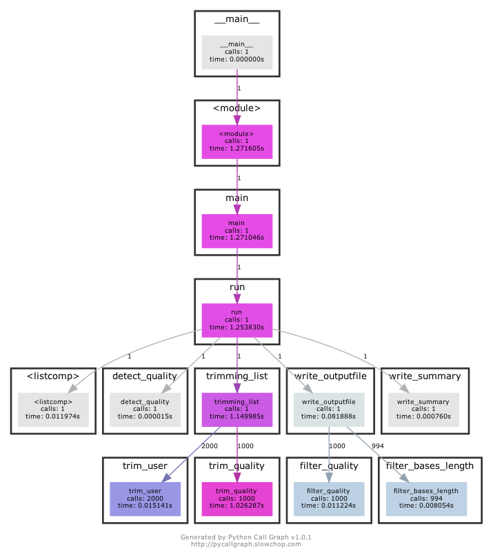
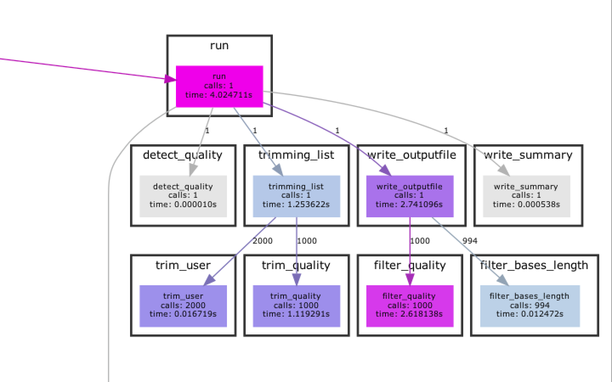

# Project
## 1. Introduction

The goal of this project is to generate a program, which trims Next-Generation Sequencing data based on quality. 

- purpose of our programm 

## 2. Theory
Next Generation Sequencing has played an important role to understand the biology mechanisms under a genomics perspective. In the earlies X the price of sequence a genome was  very high but with time, the sequencing cost has decreased and the genomic data production has increased.Generating data became easier but not the computational storage and data analysis. This output genomic data is raw and contains error sequencing in order to perform analysis downstream it must be pre-processed. There are different pipelines that could be used to preprocess the data some of them share steps like quality check, duplicated removal,  and  trimming reads.Read trimming is the process to remove low quality bases or adapters while preserving the longest high quality part of a NGS read. Trimming step led to more reads mapping to annotated genes, mitigate the effects of adapter contamination, widely assumed to increase the accuracy of SNP calling and potentially could  reduce the computational time(Didion et al., 2017; Del Fabbro et al., 2013;  Bush, 2020) on another hand there are studies where still discussing the trimming effect in RNA-seq data suggesting that read trimming is a redundant process in the quantification of RNA-seq expression data(Liao et Shi , 2020). 

Didion and colleagues mention that several trimming tools had been developed  however there is not one that simultaneously provides the accuracy, computational efficiency and feature set  to work with the types and volumes of data (Didion et al., 2017) reason why different tools are still emerging. The most common tools for trimming are Atropos, fastp, Trim Galore, and Trimmomatic(Bush, 2020).

There are two types of trimming based on 1) sequence and 2) quality. The first one is able to cut sequence adapters while the second one nucleotides based on the quality based on a prhed score. Both perspectives use a fastq file, this file keeps the information of the sequencing and is conformed by: 

1. Header with the sequence identifier and information about the run and the cluster
2. The sequence (A,C,T, G and N)
3. "+" character separator sometimes followed by the header
4. Base quality score Phred +33 or +64 enconded, represented by ASCII characters


*Figure 1-Structural example of a Fastq format*


The quality score is encrypted using the ascii code into two systems phred 33 and 64. The first one adds the 33 into the quality, the second one works in the same way so instead of adding 33 you add 64. For example using the phred+33 a quality of 20 will be represented by *“5”* who is the 53 number in ASCII code while *“T”* in +64 system (see the *Table 1*)


*Table 1 Phred+33/+64 scale*
 
 Every ASCII character represents the error propability of each nucleotide to be correct, the values are from 0 to 1,  as lower the value more certain that the nucleotide is correct while 1 means that the base is certainly wrong ( see *Table 1*). This values closer to 1 in the nucleotide sequence appears like an undeterminated based (represented as 'N'). In order to remove the reads with a specified number of N's and trim low quality nucleotides at 3' and 5' we present this program.
 
 
 
## 3. Algorithm Design

The algorithm uses mainly while structures. Further conditional statements and sequences are used.


*Figure 2 Algorithm Scheme*

This program relies on the uniform structure of FASTQ files: The first position the header followed by the sequence, the third line and the quality line. Thus, the file get read into a list and all following
operations were by calling these certain positions of the list (list position 1 for the sequence line, list position 3 for the quality line and so on).
In the first step, while iterating over the list with a while function, the trimming is performed and the quality scale determined.
After these modifications the reads are filtered. Whereby, the lines are passed to the functions which return Boolean Values. Only when
all three filter-functions (Mean Quality of the read, Number of unknown bases and the minimum length of the read) pass the test, thus return a True value, 
all four lines of the read get read into the output file. In case the read does not pass the test it will be not read into the outputfile
and counted as 'filtered'.

The programm consist of two major steps:

- **Trimming**: After the file is read into a list the sequence and the corresponding quality line will be trimmed
 - Trimming Bases: the user specified number of bases will be trimmed from the 5' and 3'end, the same amount of characters will be trimmed from the quality line
 - Trimming Quality 

```{p}
    position_sequence = 1
    positon_quality = 3
    while read list
        trimming bases: list[position_sequence, position_quality]
        trimming quality: list[position_sequence, position_quality]
        count quality trims `
     position_sequence += 4
     position_quality += 4
```

- **Filtering and Writing in Outputfile**:

```{p}
    while reading trimmed list
        filter quality, unknown bases, length if True:
            write all four lines into file
         else: count as filtered read
    write summary file with count of filtered and trimmed reads
```


## 4. Program Design
ADD the diagram


has to be keeped in mind: different phred scales, structure of a fastq file, simulatenous trimming of quality and sequence line 

## 5. Program Manual

### 5.1. Trimming and Filtering 
Following program will trimm and filter your FASTQ file according to quality, length and unknown (N's) bases. The trimming based on quality, will trimm the ends of the read lower than a quality of 20. To run the programm you must a provide a FASTQ file in the standard FASTQ format (see Chapter X). The output consist of two outputfiles - a fastq file with filtered and trimmed reads and a summaryfile which contains information about the number of filtered + trimmed reads.


*Attention* :heavy_exclamation_mark:
To make the script executable you must run following line:

```{p}
chmod +x fastqtrimmer.py
```

#### To run the program you must specify:

- **-in** the inputfile 
- **-out** the name of the outputfile 

#### Further arguments are optional:

- **-sum** the name of the summaryfile (will give you a summary of the filtered and trimmed reads) (Defaultname: Summaryfile.txt)
- **-stat**  *dont use this command for trimming*  specifiying the name of your statistics output file (details in 5.2. Statistics on FASTQ File)

##### For Trimming:

- **-end5** the number of bases which should be trimmed from the 5´end
- **-end3** the number of bases which should be trimmed from the 3' end 

##### For Filter:

- **-qual** the minimum average quality of the read (default: Quality 20)
- **-length** the minimum length of the read 
- **-nbases** the minimum number of unknown bases

### 5.2. Statistics on FASTQ File
In case you are uncertain about setting the different parameteres a statistics feature is implemented. This option will provide you with a statisitc-summaryfile with information about the quality of the reads (average, average quality of the worst and best 10% of the reads), number of reads, the average length of the reads and the total amount of the individual bases. Thus, with this information provided it will be easier to adjust parameters for trimming and filtering.

To perform statistics you must specify the name of your fastq inputfile (-in) and statistics-outputfile (-stat) and set the main-outputfile to false (-out False). Despite the commands '-in', '-out' and '-stat' not further commands should be used (see 5.3. Examples).

*Note*: You cannot perform trimming/filtering and statistics in one run.


### 5.3. Examples:

Following command trims 6 bases from each end of the read, filters all reads with a quality lower than 30, shorter than 50 nucleotides and more than two unknown bases.


```{p}
./fastqtrimmer.py -in S1.fastq -out S1_trim.fastq -sum S1_trim_summary.txt -end3 6 -end5 6 -qual 30 -length 50 -nbases 2
```


In case you only want to trimm the reads with a quality lower than 20 from each end and filter reads with a quality lower than 20, this command is enough:

```{p}
./fastqtrimmer.py -in Sample1.fastq -out Sample1_trimmed.fastq
```


Performing statistics on a FASTQ file:
```{p}
./fastqtrimmer.py -in Sample1.fastq -out False -stat Sample1_Statistics.txt
```


To get an overview over the commands you can use, use following command:
```{p}
./fastqtrimmer.py -h
```


## 6. Runtime Analysis

### 6.1.Big O
Detect_quality = O(1)
Trimmer = O(n)
Filter = O(N)
Summary = O(1)

### 6.2. Additional Analysis

The main reasons for a slowdown in our runtime are the multiple function calls and
s. An alternative approach could be to store the lines in a Numpy Array. 
An alternative approach to improve runtime performance could be to use packages such as NumPy. Hereby, we would suggest storing
the lines in a NumPy Array and passing the NumPy Array(NumPy Array with Sequence string and NumPy Array with Quality string) to the functions, instead of passing each line separately to the function.

To visualize the function calls and get a better understanding for the runtime performance we used the library [Python Call Graph](https://pycallgraph.readthedocs.io/en/master/). A cutout of those results are visible in Figure X. Since the program passes the strings individually to the functions, the amount of function calls is noticably high. Considering that for creating this scheme a fastq-file with 1000 reads was used and a common fastq file is much bigger, an reduction of these function calls should be strived. Moreover the runtime of trim_quality, is 100x times higher than, the other trim and filter functions. This is a potential point for runtime optimization.






*Figure X* Cutout of the scheme generated by PyCallGraph. Script run with a FASTQ file with 1000 reads. 

Figure X. depict


## 7. Discussion


Runtime, a lot of function calls, finding alternative to list list of lists, tuples, arrays,... COMPARE WITH EXISTING ALGORITHMS

Relying on uniform format of fastq file 

Quality of single residue trimming is 20 cant be changed by user, in further approach make it optional
We were surprised by the huge amount of runtime the filter_quality function required


Quality of single residue trimming is 20 cant be changed by user, in further approach make it optional

- maintance of the programm, changes in phred scale, fastq file format will make the script useless
- user friendly can be used by everyone who knows how to use a command line
- robustness semi good extraordinary bad fastq files? - 

The main bottleneck of the program is the detection of the Phred scale. The quality detection is extremely sensitive around the value 75 (=K), which is a quality score of 42 on Phred 33 scale and a quality score of 11 on Phred scale 64. Thus the program will fail, when the quality of the read is either consistently high (on Phred scale 33) or consistently low (on Phred scale 64). Since the quality of the first reads is commonly the lowest we choose the quality of the 100st read (which is in a common FASTQ file still an early position) for detection. In further steps their could be an error handling implemented, which uses the next read in case the quality scale of the first read can not be determined. As an alternative, another algorithm for the phred scale determination should be considered. However, using the 100st position implifies that a very small FASTQ file can not be feed to the program.

Further the algorithm relies on the uniform strucutre of a FASTQ file, any additional lines or blank lines will result in a invalid output or a premature ending of the run. 

Considering the changes in quality scales overtime, the maintance of the progam should be questioned. Any changes in the quality scale or the common format of the FASTQ file will make this program useless. 

The main strength of the program is the easy handling. For every person, who knows how to use a command line.

Additionally, the modularization of the program allows changes(for instance only trimming or filtering of the file) without messing up the program.

## 8. References
Bush, S. J. (2020). Read trimming has minimal effect on bacterial SNP calling accuracy. *bioRxiv.*

Del Fabbro, C., Scalabrin, S., Morgante, M., & Giorgi, F. M. (2013). An extensive evaluation of read trimming effects on Illumina NGS data analysis. *PloS one*, 8(12), e85024.

Didion, J. P., Martin, M., & Collins, F. S. (2017). Atropos: specific, sensitive, and speedy trimming of sequencing reads. *PeerJ*, 5, e3720.

Liao, Y., & Shi, W. (2020). Read trimming is not required for mapping and quantification of RNA-seq reads at the gene level. *NAR Genomics and Bioinformatics*, 2(3), lqaa068.

## 9. List of Figures

1. Figure: 
2. Figure:
