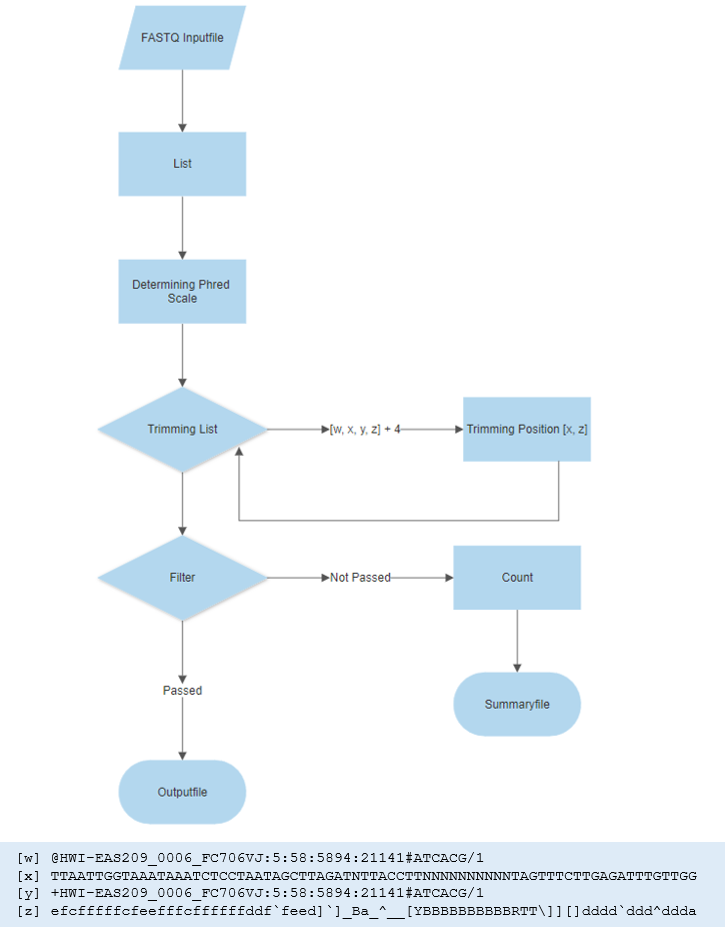
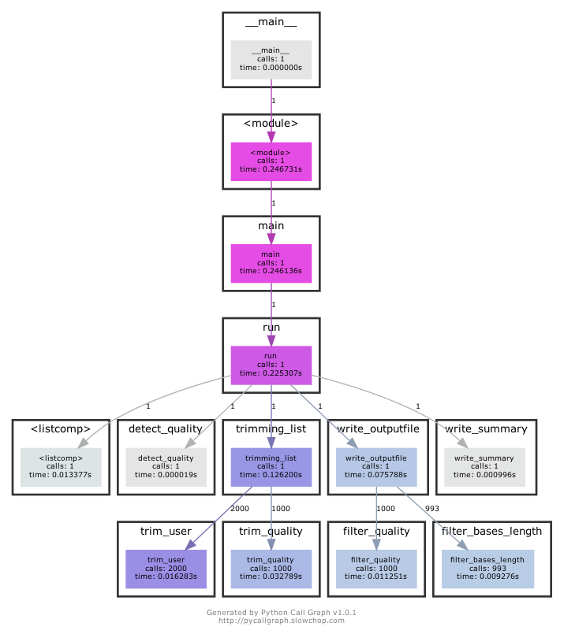

# Project

To do/think of/ not forget?
- which time to we use when writting the theory future, present, conjunktiv; will be filter, should,... i am confused lol 'has to be adjusted to the ohred scle/will be adjust/must be adjusted/is adjusted????  
- big o isnt finished but please take a look at it - its so weird - nicceeee table :): *The Big O looks wierd but it's just evaluated by function I like the end you add the summ good idea!!! :3 I read those post and for me was so cool very well explained. I changed the o(n*m) because at the end it hast two for and the form is like O(2n) reduced to O(n) it´s like one example here: https://stackabuse.com/big-o-notation-and-algorithm-analysis-with-python-examples/  the other useful page is: https://skerritt.blog/big-o/*
- yesterday was a merge conflict - we have to write the program design in pseudocode - i have added the pseudocode from yesterday, peter mentioned last time we shouldnt but the raw code in the report
-yesterday I run the program with the peter file and I got a problem with the quality. I used another file I tested with the two programs and it runs (using another file) so I added into the directory, I''l move to the correct directory test

- should put the whole picture or a cutout in 6.2.? i am not sure if the whole picture is clear


## 1. Introduction

Next-Generation Sequencing has played an important role to understand the biology mechanisms from a genomics perspective. In the early 2000s, the price of sequence a genome was very high but with time, the sequencing cost has decreased and the genomic data production has increased. Generating data became easier but not the computational storage and data analysis. This output genomic data is raw and contains error sequencing to perform analysis downstream it must be pre-processed. Different pipelines could be used to preprocess the data some of them share steps like a quality check, duplicated removal,  and trimming reads. Read trimming is the process to remove low-quality bases or adapters while preserving the longest high-quality part of an NGS read. Trimming step led to more reads mapping to annotated genes, mitigate the effects of adapter contamination, widely assumed to increase the accuracy of SNP calling and potentially could reduce the computational time (Didion et al., 2017; Del Fabbro et al., 2013;  Bush, 2020) on another hand there are studies where still discussing the trimming effect in RNA-seq data suggesting that read trimming is a redundant process in the quantification of RNA-seq expression data (Liao et Shi, 2020). 


Didion and colleagues mention that several trimming tools had been developed however there is not one that simultaneously provides the accuracy, computational efficiency, and feature set to work with the types and volumes of data (Didion et al., 2017) reason why different tools are still emerging. The most common tools for trimming are Atropos, fastp, Trim Galore, and Trimmomatic (Bush, 2020).

There are two types of trimming based on 1) sequence and 2) quality. The first one can cut sequence adapters while the second one nucleotides based on the quality based on a Phred score. Both perspectives use a FASTQ file, this file keeps the information of the sequencing and is conformed by: 

1. Header with the sequence identifier and information about the run and the cluster
2. The raw sequence (A,C,T, G and N)
3. "+" character separator sometimes followed by the header
4. Base quality score Phred +33 or +64 enconded, represented by ASCII characters


*Figure 1-Structural example of a FASTQ format*


The quality score is encrypted using the ASCII code into two systems Phred +33 and +64. '33' and  '64' represent the first value in the scales, a quality score of 0, encoded as bytes (33 ASCII character = !; 64 ASCII character = @). The conversion between these two scales is relatively easy, as the quality score is encoded as decimals on Phred +64 scale, which is always 33 higher than the quality score encoded in decimals on the Phred +33 scale. For example, using the Phred +33 a quality of 20 will be represented by *“5”* which is the 53 number in ASCII code while *“T”* in +64 system (see the *Table 1*).


*Table 1 Phred+33/+64 scale* - **source:usearchv11 page**
 
Every ASCII character represents the error probability of each nucleotide to be correct, the values are from 0 to 1, as lower the value more certain that the nucleotide is correct, while 1 means that the base is certainly wrong ( see *Table 1*). Bases with a quality score close to 1 are seen as an undetermined based and represented as 'N'.
		
The quality, length, and the number of reads have a tremendous effect on the final results of experiments. Since the desired 'quality/quantity ratio' of the reads is depending on the further approach, we generated the program 'fastqtrimmer.py'.
		
This program allows to trim and filter Next-Generation Sequencing data from Illumina platforms. Whereby, the trimming and filtering parameters, quality, number of unknown bases and read length, can be defined by the user.

## Contribution

## 2. Theory
As described in the introduction every read in a FASTQ file consists of four lines. This convention is the base of the program. Thus, the file gets read into a list and all following operations are performed by calling these certain positions of the list (list position 1 for the sequence line, list position 3 for the quality line and so on).

The output of the program consists of two files the trimmed and filtered FASTQ file and the summary file, containing the count of trimmed and filtered reads. For trimming it has to be noticed that the position 'x' in the sequence line corresponds to position 'x' in the quality line. Thus when trimming the same amount of characters has to be trimmed from both lines. 

The final output file should only contain reads with a defined maximum of unknown bases, minimum average quality, and the minimum length of the sequence. The sequence/quality line must therefore meet all three criteria. When the filters are passed the four positions of the read will are called and written into the output file, else the read is counted as 'filtered' for the summary file.

Besides filtering and trimming the quality score has to be adjusted to the determined Phred scale. 

The program is based on two trimming steps. The first one removes a user-defined number of nucleotides at 5' and 3' sense, according to a Phred value (P= *default= 20*), the second step sum the quality of each base  then is divided by the length sequence keep the one with the P-value: 

To not overwhelm the user with too many options, the trimming and quality parameters are optional.

P}" />


where the *i* is the Phred quality of the *i*-th base

As part of the design, the program can be used to remove sequencing adapters at the ends of the sequences (5' and 3').To perform it the user introduces the length of the adapters according. The program is based on two assumptions: the first is that only one adapter exists in the data; the second is that adapter sequences exist only in the read tails, assumptions that are valid for platform sequencers like Illumina HiSeq series, NextSeq series and NovaSeq (Chen et al., 2018). The mentioned strategy is applied due to the low computing time compared with the overlapping detection algorithm implemented by programs such as *fastp*, *Trimmomatic, Cutadapt and SOAPnuke*.
 
 
## 3. Algorithm Design

For this program, a linear algorithm is used and the following programming structures are included:
- Sequences
- Binary Selection
- Repetition

The general idea of the algorithm is to transform the input file into a list, and while iterating in the step of four over the list performing several operations on the elements on the list. By using binary selection the list elements are either written into the 'main' output file or counted for the secondary output file. The main algorithm is represented in Figure *X*.



*Figure 2-Algorithm Scheme*

*Note*: The binary selection between the trim/filter and the statistic operation are not mentioned.

## 4.Program Design

This program is written in Python.

### 4.1. Main

##### Main steps:
To create a command-line interface the argparse library is used. To run the program the user must define the FASTQ filename and the name of the output file. All further commands are optional and the minimum quality is specified as 20.
After the arguments of the user got passed to the run-function, the following steps are conducted:

- **Reading into a list**: after reading the file the lines are storaged into a list.

- **Determining Phred Scale**: input is the quality line as bytearray from 100st read.
```{p}
    detect_quality()
     	if mean(ASCII decimals) < 75:
      		phred_scale = 33
    	elif max(ASCII decimals ) >= 75:
      		phred_scale = 64
```

- **Trimming**: The 'main' trimming function (trimming_list) passes the strings to the function trim_user and trim_quality. The function trim_user slices the given number of characters from the input strings. Trim_quality takes the quality line (converted to a bytearray) and the sequence line as input.

```{p}
    def trimming_list()
     	
    while read list in an interval of four
         convert ASCII characters to bytearray
         trim_user: trimming bases list[position_sequence, position_quality]
         trim_quality: list[position_sequence, position_quality]
         count quality trims `
     
     def trim_user()
         slice characters from sequence and and bytearray
     
     def trim_quality()
         use determined phred scale to convert minimum quality score
         iterate over bytearray
            count number of characters to trim from 5' end
            count number of characters to trim from 3' end
         slice sequence and bytearray
         count trimming    
```

- **Filtering and Writing in Outputfile**:

```{p}
    def write_outputfile()
    while reading trimmed list in interval of four:
          def filter_quality
            	adjust quality score to phred scale, calculate mean of bytearray string
            	when average bigger than quality score return True
          def filter_unkown_bases_length
            	count 'N', determine length
            	return True
         
         if all filters return True:
           	convert bytearray to ASCII string
           	write all four lines of read into outputfile
           
         else: count as filtered read
         
     def write_summaryfile()     
          write summary file with count of filtered and trimmed reads
```

**Following procedures should be mentioned explicitly, as they are fundamental for a valid output:**

- The determined Phred scale gets passed to the trim_quality and filter_quality function to adjust the quality score.

- The sequence and the quality line always get passed together to the trimming functions, to avoid a shift in the quality score of the bases.

- During the first iteration over the list, the quality line will be converted to a bytearray and will only be translated into an ASCII character string when the read gets written into the output file.

### 4.2. Statistics
Additionally, to the trimming function, the program has a statistic function implemented. This operation provides instead of a trimmed and filtered FASTQ file, a statistics-summary file for the given FASTQ file. Containing: the mean quality of a read, the mean quality of the top and calculate the worst 10% of the reads (**find better definition**), the average spot length, as well as the number of bases and the total number of reads.
This operation will only be conducted when it is explicitly specified by the user (see 5. Program Manual).

- **Statistics**: this function provides the average of quality in the reads, the best and the worst 10% of the reads according to the quality.

```{p}
    run(takes argparse arguments)
    if outputfile false
       statistics
    
    fastq_statistics()
      open file read into
        	sequence_list
        	quality_list
    
    detect_quality()
    
    statistics_numbases(sequence_list)
       		count bases in sequence_list
      		pass results to fastq_statistics
    
    statistic_quality(quality_list - as bytearray)
         		create list with length of read
         		create list with average quality
       		sort average_quality_list
      		slice lower and upper tenpercent of the list and calculate mean
       		calculate mean with length_of_read_list
       		pass results to fastq_statistics
     
    fastq_statistics()
       		write summary
       
```


## 5. Program Manual
This program allows you to filter and trim your FASTQ file. Additionally, a feature will provide you an overview of your FASTQ file, like average quality and number of unknown bases.

### 5.1. Trimming and Filtering 
The following program will trim and filter your FASTQ file according to quality, length and unknown (N's) bases. The trimming based on quality will trim the ends of the read lower than a quality of 20. To run the program you must provide a FASTQ file in the standard FASTQ format (see Chapter 5.3). Compressed as well as uncompressed files can be feed to the program. The output consists of two output files - a FASTQ file with filtered and trimmed reads and a summary file which contains information about the number of filtered + trimmed reads.

*Attention* :heavy_exclamation_mark: :warning:
To make the script executable you must run following line:

```{p}
chmod +x fastqtrimmer.py
```

#### To run the program you must specify:

- **-in** the inputfile 
- **-out** the name of the outputfile 

#### Further arguments are optional:

- **-sum** the name of the summaryfile (will give you a summary of the filtered and trimmed reads) (Defaultname: Summaryfile.txt)
- **-stat**  *dont use this command for trimming*  specifiying the name of your statistics output file (details in 5.2. Statistics on FASTQ File)

##### For Trimming:

- **-end5** the number of bases which should be trimmed from the 5´end
- **-end3** the number of bases which should be trimmed from the 3' end 

##### For Filtering:

- **-qual** the minimum average quality of the read (default: Quality 20)
- **-length** the minimum length of the read 
- **-nbases** the minimum number of unknown bases

### 5.2. Statistics on FASTQ File
In case you are uncertain about setting the different parameters a statistics feature is implemented. This option will provide you with a statistic-summary file with information about the quality of the reads (average, the average quality of the worst and best 10% of the reads), the number of reads, the average length of the reads, and the total amount of the individual bases. Thus, with this information provided it will be easier to adjust parameters for trimming and filtering.

To perform statistics you must specify the name of your FASTQ input file (-in) and statistics-output file (-stat) and set the main-output file to false (-out False). Despite the commands '-in', '-out' and '-stat' not further commands should be used (see 5.3. Examples).

*Note*: You cannot perform trimming/filtering and statistics in one run.


### 5.3. Examples:

Following command trims 6 bases from each end of the read, filters all reads with a quality lower than 30, shorter than 50 nucleotides and more than two unknown bases.


```{p}
./fastqtrimmer.py -in S1.fastq -out S1_trim.fastq -sum SummaryS1_trim.txt -end3 6 -end5 6 -qual 30 -length 50 -nbases 2
```


In case you only want to trimm the reads with a quality lower than 20 from each end and filter reads with a quality lower than 20, this command is enough:

```{p}
./fastqtrimmer.py -in Sample1.fastq -out Sample1_trimmed.fastq
```


Performing statistics on a FASTQ file:
```{p}
./fastqtrimmer.py -in Sample1.fastq -out False -stat Sample1_Statistics.txt
```


To get an overview over the commands you can use, use following command:
```{p}
./fastqtrimmer.py -h
```


## 6. Runtime Analysis

### 6.1. Big O
To evaluate the runtime in Big O terms a small overview of the functions and their complexity is defined in the following table. Most of the structures implemented shown linear time, which means that every single element from the input is visited exactly once, *O(n)* times. As the size of the input, N, grows our algorithm's run time scales exactly with the size of the input. N hereby indicate the number of lines/reads and m the length of the read.

| Function            | Big O analysis  |  
| ------------------- |     :---:    |
| [Reading into a list](https://github.com/elena-krismer/Project_FASTQtrimmer/blob/master/fastqtrimmer_features.py)  | *O(n)*   | 
| [detect_quality()](https://github.com/elena-krismer/Project_FASTQtrimmer/blob/master/fastqtrimmer_features.py)   |   *O(1)*  | 
| [trimming_list()](https://github.com/elena-krismer/Project_FASTQtrimmer/blob/master/fastqtrimmer_features.py) | *O(n)* |
| [trim_quality()](https://github.com/elena-krismer/Project_FASTQtrimmer/blob/master/fastqtrimmer_features.py) | *O(2n)* reduced to  *O(n)* |
| [filter_quality()](https://github.com/elena-krismer/Project_FASTQtrimmer/blob/master/fastqtrimmer_features.py) | *O(n)* |
| [filter_bases_length()](https://github.com/elena-krismer/Project_FASTQtrimmer/blob/master/fastqtrimmer_features.py) | *O(n)* |
| [write_outputfile()](https://github.com/elena-krismer/Project_FASTQtrimmer/blob/master/fastqtrimmer_features.py) | *O(n)* |
| [write_summary()](https://github.com/elena-krismer/Project_FASTQtrimmer/blob/master/fastqtrimmer_features.py)   | *O(1)* |

*Table 2* Big O analysis in the main functions of the program. Where n is the number of lines, and m the length of the read.
*Note*: This table only represents an overview of the O-complexity.

O(n + 1 + n + 2n + n + n + n + 1) = *O(n)*

The length of a read, has a minor impact on the running time, thus can be ignored. The major factor for a linear increase in runtime is the number of lines (n)


### 6.2. Visuale Profiling 

To visualize the function calls and to get a better understanding for the runtime performance, we used the library [Python Call Graph](https://pycallgraph.readthedocs.io/en/master/). A cutout of those results is visible in Figure X. 

The trim and filter functions, do not distinguish significantly in runtime. The most complex operation, containing if/else statements and iteration is implemented in the trim_quality function and has the poorest runtime performance out of those four functions. As this is also the most complex function according to Big-O terms *O(2n)* (but still *O(n)*), an enhancement in this function will be beneficial. The 'cheapest' functions detetct_quality and write_summary will also remain that fast with bigger FASTQ files, as they have a Big-O complexity of *O(1)*.

Since the programm passes the strings individually to the functions, the amount of function calls is noticably high.


*Figure 3-Cutout of the scheme generated by PyCallGraph. Script run with a FASTQ file with 1000 reads.*


## 7. Discussion
One of the biggest limitations is that the program works using files from Illumina, it is not able to read files from 454, Nano, SOLID, or PacBio due to quality detection.

The main bottleneck of the program is the detection of the Phred scale. The quality detection is extremely sensitive around the value 75 (=K), which is a quality score of 42 on Phred +33 scale and a quality score of 11 on Phred +64 scale. In case the read has considerably low quality (lower than 11) on a Phred scale 64, the Phred scale will be determined incorrectly as Phred scale 33. Since the quality of the first reads is commonly the lowest we choose the quality of the 100th read (which is in a common FASTQ file still an early position) for detection. In further steps, there could be an error handling implemented, which uses the next read in case the quality scale of the first read can not be determined. As an alternative, another algorithm for the Phred scale determination should be considered. However, using the 100th position implies that a very small FASTQ file can not be feed to the program.

Further, a Big-O complexity of *O(n)* is considered a not-ideal, but desirable complexity. Instead of a linear increase of the runtime, a logarithmic increase should be aspired. However, we doubt that there is an applicable logarithmic algorithm design for this approach. 

The program is written in the dynamically-typed language Python, which means no explicit declaration of a variable is required but also implements that each variable contains extra information about their datatype. Thus, each element in our list contains its own information like the reference count and the datatype. As an alternative approach, a library such as NumPy could be used. As all lines in a FASTQ file are strings, storing them in a fixed-type array (NumPy array) could increase efficiency. Hereby, we would suggest storing the lines in a NumPy Array and passing the NumPy Array(NumPy Array with Sequence string and NumPy Array with Quality string) to the functions, instead of passing each line separately to the function (VanderPlas, 2016). This would also decrease the numerous function calls (visualized 6.2.).

The main strength of the program is the easy handling. For every person, who knows how to use a command line.

Additionally, the modularization of the program allows changes(for instance only trimming or filtering of the file) without messing up the program.

Overall, the program is functional and provides the desired output.

## 8. References

Bush, S. J. (2020). Read trimming has minimal effect on bacterial SNP calling accuracy. *bioRxiv.*

Chen, S., Zhou, Y., Chen, Y., & Gu, J. (2018). fastp: an ultra-fast all-in-one FASTQ preprocessor. *Bioinformatics*, 34(17), i884-i890.

Del Fabbro, C., Scalabrin, S., Morgante, M., & Giorgi, F. M. (2013). An extensive evaluation of read trimming effects on Illumina NGS data analysis. *PloS one*, 8(12), e85024.

Didion, J. P., Martin, M., & Collins, F. S. (2017). Atropos: specific, sensitive, and speedy trimming of sequencing reads. *PeerJ*, 5, e3720.

Liao, Y., & Shi, W. (2020). Read trimming is not required for mapping and quantification of RNA-seq reads at the gene level. *NAR Genomics and Bioinformatics*, 2(3), lqaa068.
usearch page: https://drive5.com/usearch/manual/quality_score.html

VanderPlas, J. (2016) Python Data Science Handbook. *O'Reilly Media*.

## 9. List of Figures

1. Figure: Structural example of a Fastq format
2. Figure: Algorithm Scheme
3. Figure:Cutout of the scheme generated by PyCallGraph. Script run with a FASTQ file with 1000 reads
