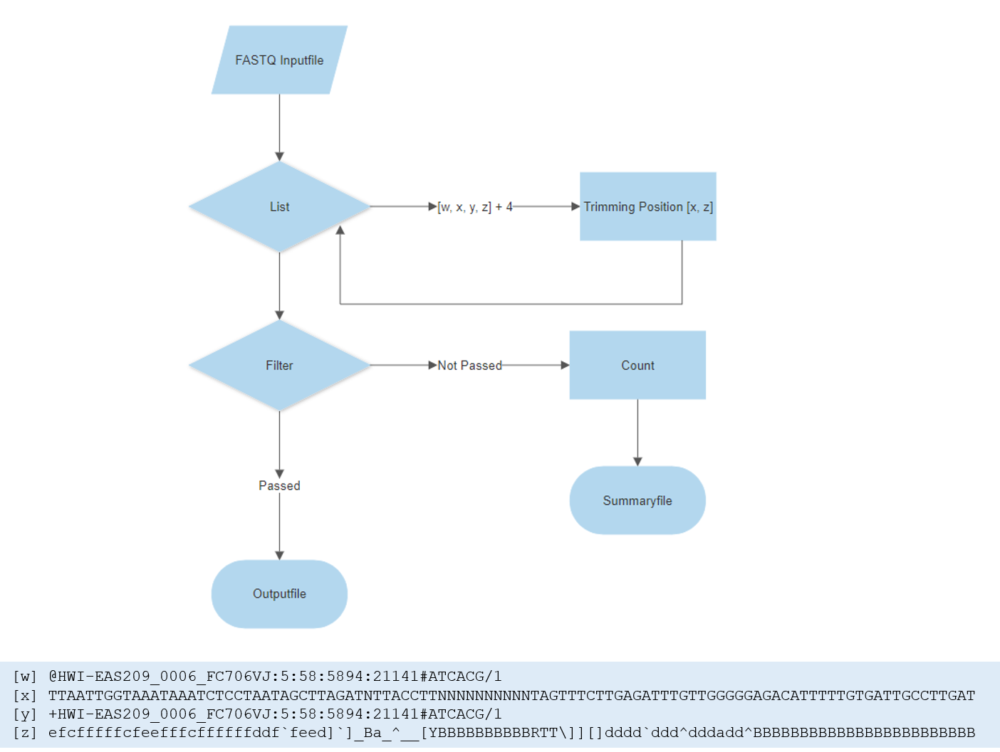

# Project
## 1. Introduction

The goal of this project is to generate a program, which trims Next-Generation Sequencing data based on quality. 

- purpose of our programm 

## 2. Theory
Next Generation Sequencing has played an important role to understand the biology mechanisms under a genomics perspective.In the earlies X the price of sequence a genome was  very high but with time, the sequencing cost has decreased and the genomic data production has increased.Generating data became easier but not the computational storage and data analysis. This output genomic data is raw and contains error sequencing,  in order to perform analysis downstream it must be pre-processed. There are different pipelines that could be used to preprocess the data some of them share steps like quality check, duplicated removal,  and  trimming reads.Read trimming is the process to remove low quality bases or adapters while preserving the longest high quality part of a NGS read. Trimming step led to more reads mapping to annotated genes, mitigate the effects of adapter contamination and potentially could  reduce the computational time(Didion,J.P *et al*., 2017; Del Fabbro et al., 2013) on another hand there are studies where still discussing the trimming effect in RNA-seq data suggesting an  impact in the accuracy of the gene expression quantification(Liao Y and Shi W., 2020). 

Didion and  colleagues mention that several trimming tools had been developed  however there is not one that simultaneously provides the accuracy, computational efficiency and feature set  to work with the types and volumes of data (Didion,J.P *et al*., 2017) reason why different tools are still emerging.


There are two types of trimming  based on 1) sequence and 2) quality. The first one is able to cut sequence adapters while the second one nucleotides based on the quality based on a prhed score. Both perspectives use a fastq file, this file is conformed by: 

1. Header with the sequence identifier 
2. The sequence 
3. "+" character 
4. Quality score 


*Figure 1* Fastq format 


The quality score is encrypted using the ascii code into two systems phred 33 and 64. The first one adds the 33 into the quality, the second one works in the same way so instead of adding 33 you add 64. For example using the phred+33 a quality of 20 will be represented by *“5”* who is the 53 number in ASCII code while *“T”* in +64 system (see the *Table 1*)


*Table 1* Phred+33/+64 scale 


- Whats next generation sequencing? 
- Whats a FASTQ File? structure
- Where is used/important - Why we need to trim file?
- Whats phred scale? 
- types of trimming


## 3. Algorithm Design




*Figure X* Algorithm Scheme

This program relies on the uniform structure of FASTQ files: The first position the header followed by the sequence, the third line and the quality line. Thus, the file get read into a list and all following
operations were by calling these certain positions of the list (list position 1 for the sequence line, list position 3 for the quality line and so on).
In the first step, while iterating over the list with a while function, the trimming is performed and the quality scale determined.
After these modifications the reads are filtered. Whereby, the lines are passed to the functions which return Boolean Values. Only when
all three filter-functions (Mean Quality of the read, Number of unknown bases and the minimum length of the read) pass the test, thus return a True value, 
all four lines of the read get read into the output file. In case the read does not pass the test it will be not read into the outputfile
and counted as 'filtered'.

```{p}
main()
    read file into list
    while read list
        determine phred: position quality
        trim position 1(+4)/sequence and 3(+4)/quality
        trim quality 1(+4)/sequence and 3(+4)/quality
        count quality trims `

    while reading modified list
        filter quality, unknown bases, length if True:
            read first, second, third and fourth line into file
         else: count as filtered read
    write summary file with count of filtered and trimmed reads
```


## 4. Program Design


has to be keeped in mind: different phred scales, structure of a fastq file, simulatenous trimming of quality and sequence line 

## 5. Program Manual

Following program will trimm and filter your FASTQ file according to quality, length and unknown (N's) bases. The trimming based on quality, will trimm the ends of the read lower than a quality of 20. To run the programm you must a provide a FASTQ file in the standard FASTQ format (see Chapter X). The output consist of two outputfiles - a fastq file with filtered and trimmed reads and a summaryfile which contains information about the number of filtered + trimmed reads.

## To run the program you must specify:

- **-in** the inputfile 
- **-out** the name of the outputfile 

### Further arguments are optional but are adviced to be specified:

- **-sum** the name of the summaryfile (will give you a summary of the filtered and trimmed reads) (Defaultname: Summaryfile)

#### For Trimming:

- **-end5** the number of bases which should be trimmed from the 5´end
- **-end3** the number of bases which should be trimmed from the 3' end 

#### For Filter:

- **-qual** The minimum average quality of the read (default: Quality 20)
- **-length** the minimum length of the read 
- **-nbases** the minimum of unknown bases

## Addention!
To make the script executable you must run following line:

```{p}
chmod +x fastqtrimmer.py
```

### Examples:

Following command trims 6 bases from each end of the read, filters all reads with a quality lower than 30, shorter than 50 nucleotides and more than two unknown bases.


```{p}
./fastqtrimmer.py -in Sample1.fastq -out Sample1_trimmed.fastq -sum SummarySample1_trimming.txt -end3 6 -end5 6 -qual 30 -length 50 -nbases 2
```


In case you only want to trimm the reads with a quality lower than 20 from each end, this command is enough:

```{p}
./fastqtrimmer.py -in Sample1.fastq -out Sample1_trimmed.fastq
```

To get an overview over the commands you can use, use following command:
```{p}
./fastqtrimmer.py -h
```


## 6. Runtime Analysis

The main reasons for a slowdown in our runtime are the multiple function calls and
s. An alternative approach could be to store the lines in a Numpy Array. 
An alternative approach to improve runtime performance could be to use packages such as NumPy. Hereby, we would suggest storing
the lines in a NumPy Array and passing the NumPy Array(NumPy Array with Sequence string and NumPy Array with Quality string) to the functions, instead of passing each line separately to the function.

## 7. Discussion

Runtime, a lot of function calls, finding alternative to list list of lists, tuples, arrays,... 

Relying on uniform format of fastq file 

Quality of single residue trimming is 20 cant be changed by user, in further approach make it optional

## 8. References

## 9. List of Figures

1. Figure: 
2. Figure:
